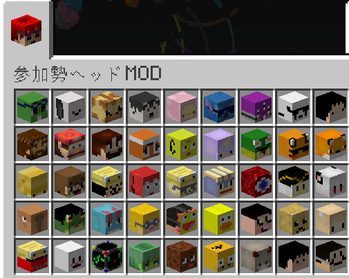

# 参加勢ヘッドMOD
- 参加勢のヘッドブロックを追加するMOD



## バージョン 
- minecraft 1.16.5
- forge 36.2.39

## 仕様
- ヘッドブロックは右クリックすると向きが変わる。
- プレイヤーの足元にヘッドブロックを設置し続けるオプションあり
## コンフィグ(sankazeiheadmod.toml)
- ヘッドブロックの自動設置はサバイバルもしくはアドベンチャーのみで機能する

|| player_executed | item_executed |
| ---- | ---- | ---- |
|データ型|boolean|boolean|
|デフォルト| False | False |
|説明|True->参加勢自身のブロックが足元に配置される|True->プレイヤーのオフハンドにあるヘッドブロックが足元に配置される|
## コマンド
- Filled_By_Playerの値を変更
- onにすると自動的に設置ブロック数をカウントするスコアボード(headcount)が作成される
```
/sankazeihead Filled_By_Player on
```
```
/sankazeihead Filled_By_Player off
```
- Filled_With_Blockの値を変更
- onにすると自動的に設置ブロック数をカウントするスコアボードが作成される
```
/sankazeihead Filled_With_Block on
```
```
/sankazeihead Filled_With_Block off
```
- スコアボードをリセットする
```
/sankazeihead resetScore
```
- コンフィグの値を取得
```
/sankazeihead getConfig
```